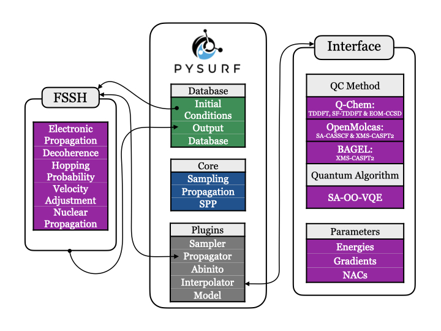

==============================================================================
PySurf-FSSH: New Plugin for PySurf to Perform Nonadiabatic Dynamics using FSSH
==============================================================================

The FSSH Plugin is based on the standard FSSH algorithm proposed by Tully plus a decoherence correction to avoid overcoherence and a velocity adjustment to conserve the total energy. A comprehensive comparison using this plugin between the conventional Tully’s fewest switches surface hopping (FSSH) scheme and the Landau–Zener surface hopping (LZSH) to study photoinduced ring-opening of 1,3-cyclohexadiene to 1,3,5-hexatriene at SF-TDDFT level can be found here_.

.. _here: https://pubs.acs.org/doi/10.1021/acs.jctc.4c00012

Requirements
------------

    - pycolt >=0.2
    - qctools

Both can be installed by:

    pip install pycolt qctools

Additionally:

    - netcdf4
    - numpy
    - matplotlib

* Free software: Apache License 2.0

General Aim:
____________

    - Fast prototyping
    - Easily extensible
    - Light-weight 
    - Developer/user friendly

Interfaces:
____________

    - Q-Chem_: TDDFT, SF-TDDFT & EOM-CCSD
    - OpenMolcas_: SA-CASSCF, XMS-CASPT2 
    - BAGEL_: XMS-CASPT2
    - SA-OO-VQE_ (Quantum Algorithm)
.. _Q-Chem: https://manual.q-chem.com/latest/
.. _OpenMolcas: https://gitlab.com/Molcas/OpenMolcas
.. _BAGEL: https://nubakery.org/
.. _SA-OO-VQE: https://github.com/qc2nl/SAOOVQE

Documentation:
--------------

https://pysurf-fssh.readthedocs.io/

Credits:
--------

This work was supported by the Innovational Research Incentives Scheme Vidi 2017 with project number 016.Vidi.189.044, (partly) funded by the Dutch Research Council (NWO).

This package was created with Cookiecutter_ and the `audreyr/cookiecutter-pypackage`_ project template.

.. _Cookiecutter: https://github.com/audreyr/cookiecutter
.. _`audreyr/cookiecutter-pypackage`: https://github.com/audreyr/cookiecutter-pypackage
